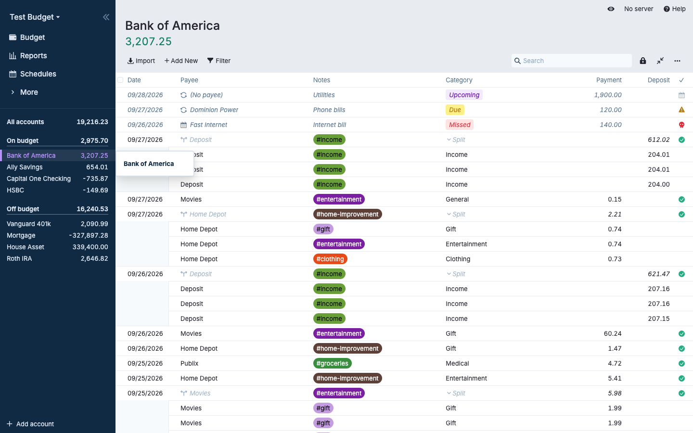
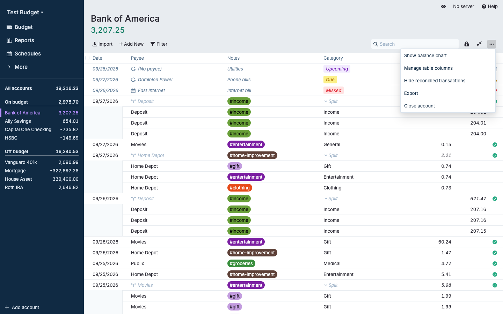
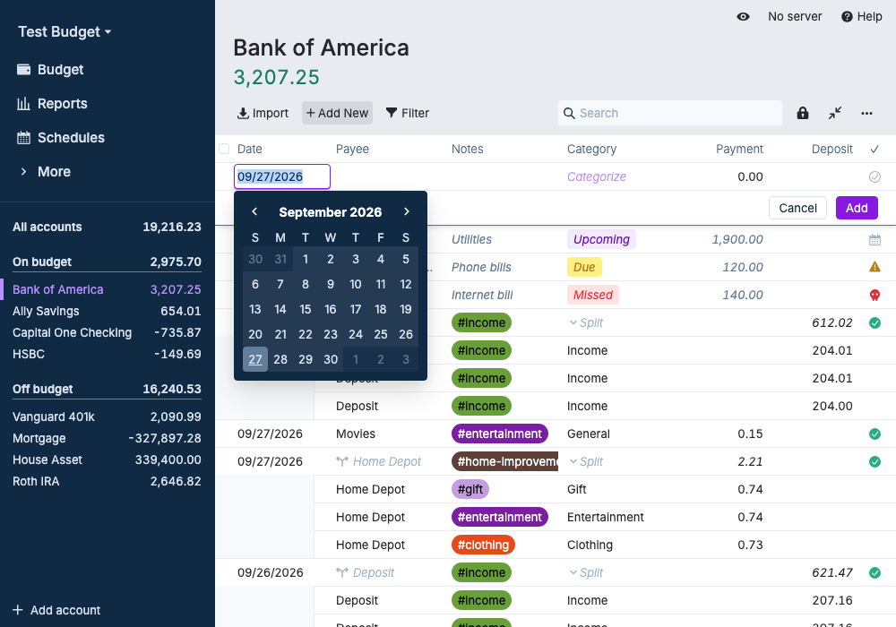
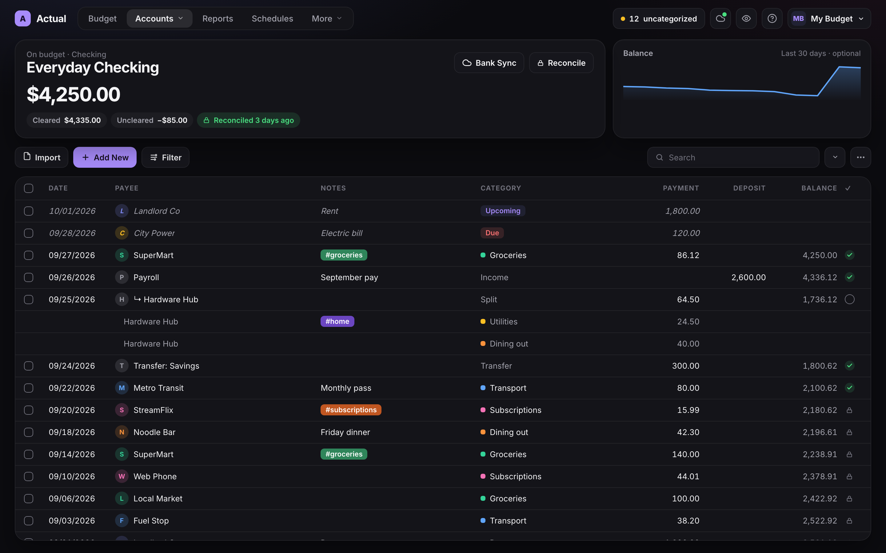

# Accounts review — anticipating issues

Prepared September 27, 2026 during DESIGN-01. Screenshots named `current-*` show the unmodified app (v26.9.0 built preview, **Try the demo** data, fresh isolated browser context). Prototype images are in [`../prototype/shots/`](../prototype/shots/) (`14`–`17`).

## What the Accounts screen does today

| Area          | Behavior (source)                                                                                                                                                                | Notes for the redesign                                                                                                                |
| ------------- | -------------------------------------------------------------------------------------------------------------------------------------------------------------------------------- | ------------------------------------------------------------------------------------------------------------------------------------- |
| Routes        | `/accounts` (all), on-budget and off-budget views, `/accounts/:id` (`FinancesApp.tsx`)                                                                                           | Multi-account views add an **Account** column.                                                                                        |
| Header        | Editable account name, notes button, balance (click for Cleared/Uncleared, plus Selected and Filtered balances when relevant) (`Header.tsx`, `Balance.tsx`)                      | Balance breakdown already exists; the hero card just shows it more openly.                                                            |
| Toolbar       | Bank Sync (linked accounts; offline state), Import, Add New, Filter, Search, Reconcile (lock), collapse/expand splits, account menu                                              | The selection button **replaces** Add New when rows are selected (`SelectedTransactionsButton.tsx`).                                  |
| Account menu  | Show balance chart, Manage table columns, Hide/Show reconciled, Export, Link/Unlink bank, Close/Reopen account, Remove sorting                                                   |                                                                                                 |
| Register      | Virtualized shared `Table` with `ROW_HEIGHT = 32` and `rowHeight − 1` offsets (`table.tsx`)                                                                                      | Row-height changes are the riskiest part of the whole redesign (below).                                                               |
| Columns       | Select, Date, (Account), Payee, Notes with tag pills, Category, Payment, Deposit, optional running **Balance**, Cleared/Reconciled                                               | Columns and order are **user-configurable** per account and saved in synced prefs (`transaction-table-columns` modal, `saveColumns`). |
| Row types     | Schedule previews (italic; Upcoming/Due/Missed pills), split parents with indented children, transfers, reconciled (locked) rows, the inline new-transaction row with Cancel/Add |                                                                                                                                       |
| Editing       | Inline cell editing, keyboard movement, autocompletes and date picker in react-aria popovers (`Autocomplete.tsx`, `DateSelect.tsx`)                                              | Popovers render in portals, so rounded cards with `overflow: hidden` won't clip them. Still worth verifying.                          |
| Bulk actions  | Selection menu: edit field (E/A/P/N/C/M/L hotkeys), duplicate, delete, link/unlink schedule, create rule, run rules, make transfer, split/unsplit, merge                         | Hotkeys must keep working.                                                                                                            |
| Reconcile     | Enter the statement balance, lock transactions, create a reconciliation transaction, last-synced balance (`Reconcile.tsx`)                                                       | A mode that changes the header; needs its own layout state.                                                                           |
| Balance chart | Optional per account (`show-account-<id>-net-worth-chart`, `BalanceHistoryGraph.tsx`)                                                                                            | Maps naturally onto a Copilot-style chart card.                                                                                       |
| Budget link   | Clicking a category's Activity on the budget opens `/accounts` filtered to that category and month (`budget/index.tsx` `onShowActivity`)                                         | Must keep working.                                                                                                                    |
| Titlebar      | `AccountSyncCheck` shows bank-sync errors on `/accounts/:id` (`Titlebar.tsx`)                                                                                                    | **Missing from the DESIGN-01 destination map; added below.**                                                                          |

At 1000px the current register already truncates Account, Payee, Notes and tags, even with the sidebar taking 240px:

## Prototype treatment

- **Hero card**: account type eyebrow, name, large balance, and chips for Cleared, Uncleared, Selected (when rows are selected) and reconciliation status. Bank Sync and Reconcile sit in the card.
- **Optional balance chart card** beside it (the existing per-account toggle). Hidden below 1280px.
- **Toolbar** keeps today's order and the selection-button swap (`15-account-light-wide-selected.png`).
- **Register in one card**: 36px rows; category shown with its accent dot (the same color as its budget tile); payee initial avatar; cleared status as check, empty ring, or lock; tags keep **their user-chosen colors** and square-ish shape so they're never confused with budget status pills.
- **Below 1280px** the hero collapses to one compact band (`17-account-light-1000.png`), which fits about 12 transactions at 1000×700.

## The details panel on Accounts

**Recommendation: no category details panel on account registers.**

- The register needs every pixel of width. At 1000px it already truncates without a panel.
- Actual's register edits inline. A transaction "inspector" panel like Copilot's would either duplicate the editor (ruled out in plan §10) or conflict with click-to-edit.
- The panel stays a **Budget page feature**, open by default there. Its open/closed state is remembered per device.
- Possible later option (not planned): an opt-in inspector for read-only context on a selected transaction, such as the category's Available and linked schedule, only at wide widths.

Other pages: Reports and Schedules have no panel. Payees, Rules, Tags and Settings are forms and lists; no panel.

## Issues we will run into

1. **Row height and virtualization (high risk).** The shared `Table` assumes 32px rows with `rowHeight − 1` spacing, and the register, Payees, Schedules, Tags, Bank Sync and the import dialog all use it. Schedules already passes a taller row (43px) through the prop, which is the precedent to follow. Taller Copilot-style rows need the height passed through the existing `rowHeight` prop, never a CSS-only change, and scrolling, keyboard focus, and "scroll to new transaction" must be retested. Suggest 36px for the register only, as a scoped variant.
2. **User-configured columns.** Auto-hiding columns at small widths (as the prototype does with Balance) would silently override the user's column choices. The real implementation should keep the user's columns and let wide text truncate, or scroll horizontally, rather than hide columns.
3. **Account name vs budget words.** The register's "Balance" column is an account running balance and must **not** become "Available" in the wording change (TERM-01). Same for "Cleared total".
4. **Class component.** `Account.tsx` is a 2,100-line class component holding filters, selection, reconciliation and prefs. Restyle it through its child components (`Header.tsx`, `Balance.tsx`, the table) and don't restructure it.
5. **Hero height at small windows.** A full hero header leaves about four rows at 1000×700 while adding a transaction. The compact band is required, not optional.
6. **Selection and filter balances.** The Selected and Filtered balances must appear in the hero chips when active, and privacy mode must hide the chips and the chart.
7. **Reconciliation mode.** Needs its own hero state: statement balance entry, difference, lock and "create reconciliation transaction". It isn't mocked yet; add it in DESIGN-02.
8. **Bank-sync status.** The per-account sync error (`AccountSyncCheck`) needs a home, such as a warning chip in the hero with its existing actions. The Accounts menu status dots must use the same states.
9. **Multi-account views.** All accounts, On budget and Off budget add the Account column and have no Reconcile or Bank Sync. The hero shows the group total and the chips that apply.
10. **Schedule preview rows and status pills.** Keep them visually distinct from posted transactions (italic, status pill) and from budget pills.
11. **Mobile routes.** Below 730px Actual renders its separate mobile account screens (`useResponsive`), so the desktop register design only needs to hold from 730px up.

## Destination map additions

| Item                             | Today                       | Redesign                                            |
| -------------------------------- | --------------------------- | --------------------------------------------------- |
| Bank-sync error for this account | Titlebar `AccountSyncCheck` | Warning chip in the account hero card, same actions |
| Account notes                    | Header notes button         | Icon button beside the account name in the hero     |
| Edit account name                | Click the name              | Same, in the hero                                   |
